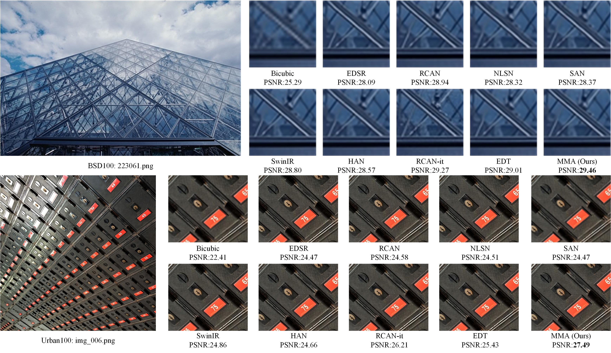

# Activating Wider Areas in Image Super-Resolution

Cheng Cheng, Hang Wang, [Hongbin Sun](https://gr.xjtu.edu.cn/en/web/hsun/home)

#### 🔥🔥🔥 News

- **2023-07-16:** This repo is released.


[[arXiv](http://arxiv.org/abs/2403.08330)]


---

> **Abstract:** *The prevalence of convolution neural networks (CNNs) and vision transformers (ViTs) has markedly revolutionized the area of single-image super-resolution (SISR). To further boost the SR performances, several techniques, such as residual learning and attention mechanism, are introduced, which can be largely attributed to a wider range of activated area, that is, the input pixels that strongly influence the SR results. However, the possibility of further improving SR performance through another versatile vision backbone remains an unresolved challenge. To address this issue, in this paper, we unleash the representation potential of the modern state space model, i.e., Vision Mamba (Vim), in the context of SISR. Specifically, we present three recipes for better utilization of Vim-based models: 1) Integration into a MetaFormer-style block; 2) Pre-training on a larger and broader dataset; 3) Employing complementary attention mechanism, upon which we introduce the MMA.
The resulting network MMA is capable of finding the most relevant and representative input pixels to reconstruct the corresponding high-resolution images. Comprehensive experimental analysis reveals that MMA not only achieves competitive or even superior performance compared to state-of-the-art SISR methods but also maintains relatively low memory and computational overheads (e.g., +0.5 dB PSNR elevation on Manga109 dataset with 19.8 M parameters at the scale of 2). Furthermore, MMA proves its versatility in lightweight SR applications. Through this work, we aim to illuminate the potential applications of state space models in the broader realm of image processing rather than SISR, encouraging further exploration in this innovative direction.* 





## TODO
- Update lightweight results


## Dependencies

- Python 3.10
- PyTorch 2.1.1
- NVIDIA GPU + [CUDA](https://developer.nvidia.com/cuda-downloads)

```
# Clone the github repo and go to the default directory 'DAT'.

git clone https://github.com/ArsenalCheng/MMA.git
conda create -n MMA python=3.8
conda activate MMA
pip install -r requirements.txt
python setup.py develop
```


## Contents

1. [Datasets](#Datasets)
1. [Models](#Models)
1. [Training](#Training)
1. [Testing](#Testing)
1. [Results](#Results)
1. [Citation](#Citation)
1. [Acknowledgements](#Acknowledgements)

---

## Datasets

Used training and testing sets can be downloaded as follows:

| Training Set                                                 |                         Testing Set                          |
| :----------------------------------------------------------- | :----------------------------------------------------------: | 
| [DIV2K](https://data.vision.ee.ethz.ch/cvl/DIV2K/) (800 training images, 100 validation images) +  [Flickr2K](https://cv.snu.ac.kr/research/EDSR/Flickr2K.tar) (2650 images) [complete training dataset DF2K: [Google Drive](https://drive.google.com/file/d/1TubDkirxl4qAWelfOnpwaSKoj3KLAIG4/view?usp=share_link)] | Set5 + Set14 + BSD100 + Urban100 + Manga109 [complete testing dataset: [Google Drive](https://drive.google.com/file/d/1yMbItvFKVaCT93yPWmlP3883XtJ-wSee/view?usp=sharing)] |


## Models

| Method    | Scale | Dataset  | PSNR (dB) |  SSIM  |                          Model Zoo                           |
| :-------- | :----: | :-------: | :------: | :-------: | :----: | 
| MMA       | 2     | Urban100 |   34.13   | 0.9446 | [Google Drive](https://drive.google.com/drive/folders/1OW9fdzqrMh-j_OA6VC77ZMvKCnOtfiqq?usp=drive_link) |
| MMA       | 3     | Urban100 |   29.93   | 0.8829 | [Google Drive](https://drive.google.com/drive/folders/1wF7kdCV_JdwKghzeS-zzUOPt3dMUSzqG?usp=drive_link)|
| MMA       | 4     | Urban100 |   27.63   | 0.8274 | [Google Drive](https://drive.google.com/drive/folders/1HDULsB8jJKLNfrV0_Xs6Us4CMtH4T3_I?usp=drive_link)|


## Training

- Download training (DF2K, already processed) and testing (Set5, Set14, BSD100, Urban100, Manga109, already processed) datasets, place them in `datasets/`.

- Run the following scripts. The training configuration is in `options/train/`.

  ```
  # MMA-x2, input=64x64, 8 GPUs

  torchrun --nproc_per_node=8 --master_port=4321 basicsr/train.py -opt options/train/MMA/train_MMA_x2_pretrain.yml --launcher pytorch

  Then change the *pretrain_network_g* in options/train/MMA/train_MMA_x2_finetune.yml to the best ckp during pretraining.
 
  torchrun --nproc_per_node=8 --master_port=4321 basicsr/train.py -opt options/train/MMA/train_MMA_x2_finetune.yml --launcher pytorch

  # MMA-x3, input=64x64, 8 GPUs

  torchrun --nproc_per_node=8 --master_port=4321 basicsr/train.py -opt options/train/MMA/train_MMA_x3_pretrain.yml --launcher pytorch

  Then change the *pretrain_network_g* in options/train/MMA/train_MMA_x3_finetune.yml to the best ckp during pretraining.
 
  torchrun --nproc_per_node=8 --master_port=4321 basicsr/train.py -opt options/train/MMA/train_MMA_x3_finetune.yml --launcher pytorch

  # MMA-x4, input=64x64, 8 GPUs

  torchrun --nproc_per_node=8 --master_port=4321 basicsr/train.py -opt options/train/MMA/train_MMA_x4_pretrain.yml --launcher pytorch

  Then change the *pretrain_network_g* in options/train/MMA/train_MMA_x4_finetune.yml to the best ckp during pretraining.
 
  torchrun --nproc_per_node=8 --master_port=4321 basicsr/train.py -opt options/train/MMA/train_MMA_x4_finetune.yml --launcher pytorch
  
  ```

- The training experiment is in `experiments/`.

## Testing

### Test images with HR

- Download the pre-trained [models](https://drive.google.com/drive/folders/1j32og3Yn7z_je1m_yR3qLEz2yqOLuhv4?usp=drive_link) and place them in `experiments/pretrained_models/`.

  We provide pre-trained models for image SR: MMA (x2, x3, x4).

- Download testing (Set5, Set14, BSD100, Urban100, Manga109) datasets, place them in `datasets/`.

- Run the following scripts. The testing configuration is in `options/test/` (e.g., [test_MMA_x2.yml](options/Test/test_MMA_x2.yml)).

  ```shell
  # MMA, reproduces results in Table 1 of the main paper

  python basicsr/test.py -opt options/test/test_MMA_x2.yml
  python basicsr/test.py -opt options/test/test_MMA_x3.yml
  python basicsr/test.py -opt options/test/test_MMA_x4.yml
  ```

- The output is in `results/`.


## Citation

If you find the code helpful in your research or work, please cite the following paper(s).

```
@misc{cheng2024activating,
      title={Activating Wider Areas in Image Super-Resolution}, 
      author={Cheng Cheng and Hang Wang and Hongbin Sun},
      year={2024},
      eprint={2403.08330},
      archivePrefix={arXiv},
      primaryClass={cs.CV}
}
```

## Acknowledgements

This code is built on  [BasicSR](https://github.com/XPixelGroup/BasicSR).